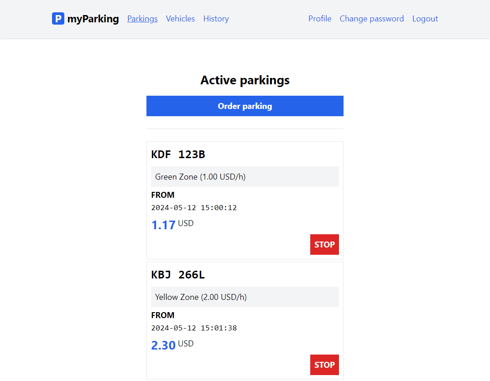

# 🅿 myParking App

myParking is a Vue.js application that serves as a car parking management system. It communicates with a Laravel backend through APIs to provide various functionalities related to parking management.



## ✨ Features

- User registration and login
- Profile and password management
- API Endpoints protection by [Laravel Sanctum](https://laravel.com/docs/sanctum)
- Managing vehicles and parking start/stop events
- [API Documentation](https://car-parking-backend.victorallenmuigua.xyz/docs) 


## 🔨Tech Stack

**Frontend:** Vue, Vite, TailwindCSS, Pinia, Axios

**Backend:** Laravel, Sanctum

**Database:** MySQL


## 🚀 Getting Started & Run Locally 

Clone the project

```bash
  git clone https://github.com/vamuigua/car_parking_app.git
```

Go to the project directory

```bash
  cd car_parking_app
```

## 📐Setting app the different apps
From here you will see two folders: `backend` and `frontend` .The `backend` is the laravel app that servers the APIs to the`frontend` which is a Vue JS application.

We shall first install and configure the `backend` then afterwards the `frontend`:

### 1. Backend Configuration (Laravel App)
Go to the `backend` directory

```bash
  cd backend
```

Install dependencies

```bash
  composer install
```

Change directory permissison

```bash
  chmod -R 777 storage bootstrap/cache
```

Create an `.env` file

```bash
  touch .env
  cp .env.example .env
```

Update the following environment variables in the `.env` file:

```bash
APP_URL=http://localhost:8000
FRONTEND_URL=http://localhost:5173
SESSION_DOMAIN=localhost
SANCTUM_STATEFUL_DOMAINS=localhost:5173
```

Generate an Application Key

```bash
  php artisan key:generate
```

Migrate the Database

*PS: Ensure you have created a database of your choose before hand e.g `car_packing_app`*

```bash
  php artisan migrate
```

Start the app by running the server

```bash
  php artisan serve
```

The `backend` app will be served on URL http://localhost:8000/

Now we can move to configuring the `frontend`

### 2. Frontend Configuration (Vue JS App)
Go to the `frontend` directory

```bash
  cd frontend
```

Install dependencies

```bash
  npm install
```

Create an `.env` file

```bash
  touch .env
```

Update the following environment variable in the `.env` file:

```
VITE_CAR_PARKING_BACKEND_API=http://localhost:8000
```

*E.g http://localhost:8000 is the URL serving the laravel application.*

Start the app server

```bash
  npm run dev
```

The `frontend` app will be served on URL http://localhost:5173/

✅ **Start using myParking app:** Once the app is running, you can start by creating an account by visiting the [registration page](http://localhost:5173/register) and explore the app's features.

## 📖 API Reference

Documentation for the APIs can be found [here](https://car-parking-backend.victorallenmuigua.xyz/docs)

Some of the APIs you can find include:

#### Get all available zones

```http
  GET api/v1/zones
```

#### Get an authenticated user's profile

```http
  GET api/v1/profile
```

| Authorization | Type     | Description                       |
| :-------- | :------- | :-------------------------------- |
| `Bearner Token`      | `string` | **Required**. |

#### Login as a User

```http
  POST api/v1/login
```

| Parameter | Type     | Description                       |
| :-------- | :------- | :-------------------------------- |
| `email`      | `email` | **Required**. |
| `password`      | `string` | **Required**. |
| `remember`      | `bool` | Determines whether the Token will expire at a defined time or not. |

## 👨‍🔬 Running Tests 

To run tests on the laravel backend app, run the following command

```bash
  php artisan test
```


## 🙏 Acknowledgements

 - [LaravelDaily](https://laraveldaily.com) by [Povilas Korop](https://github.com/PovilasKorop)


## 📣 Feedback 

If you have any feedback, please reach out at vamuigua@gmail.com

